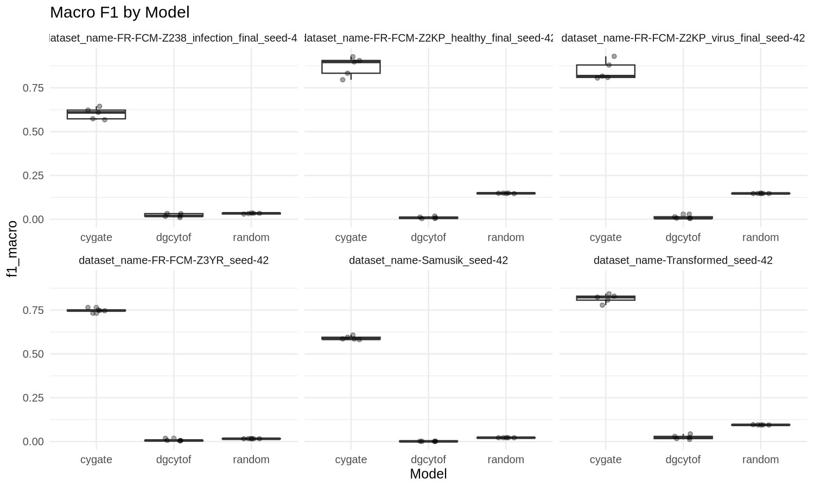
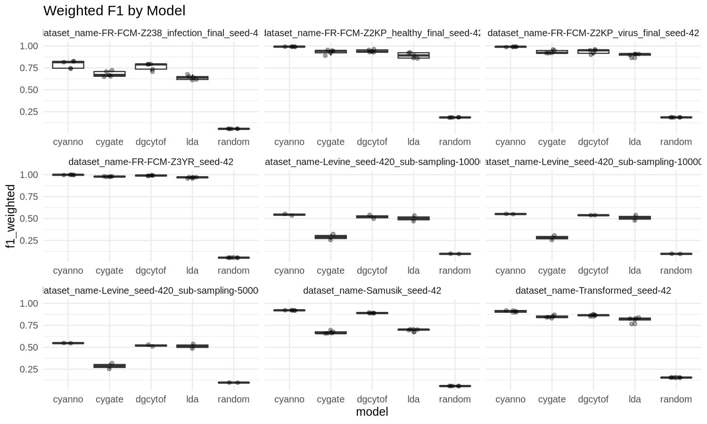
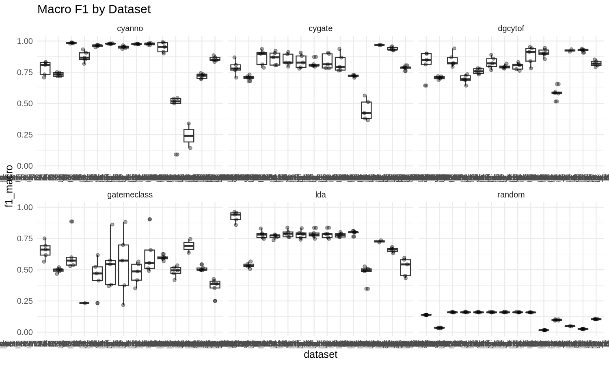
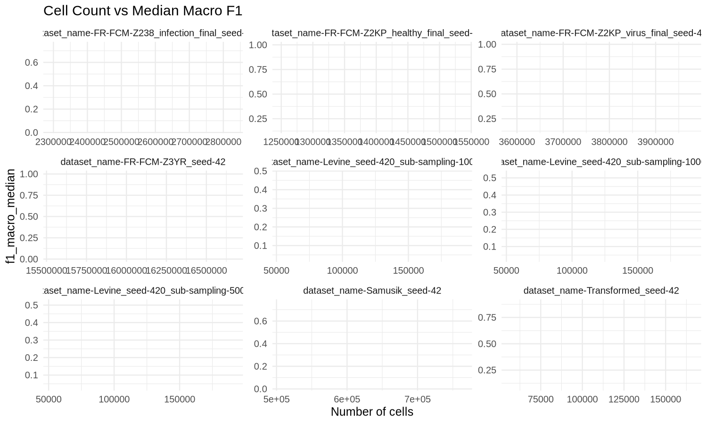
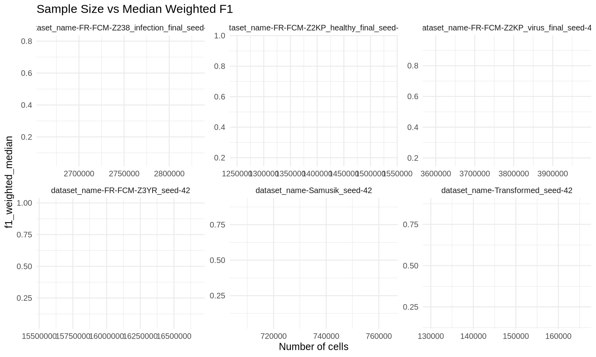
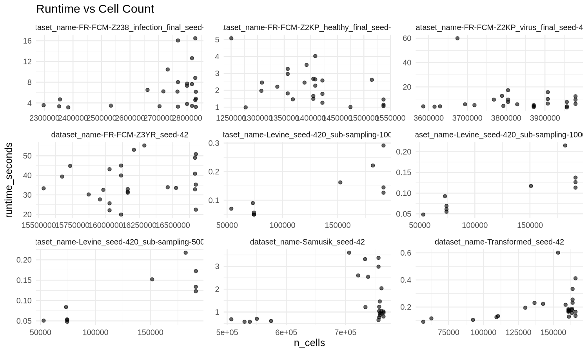
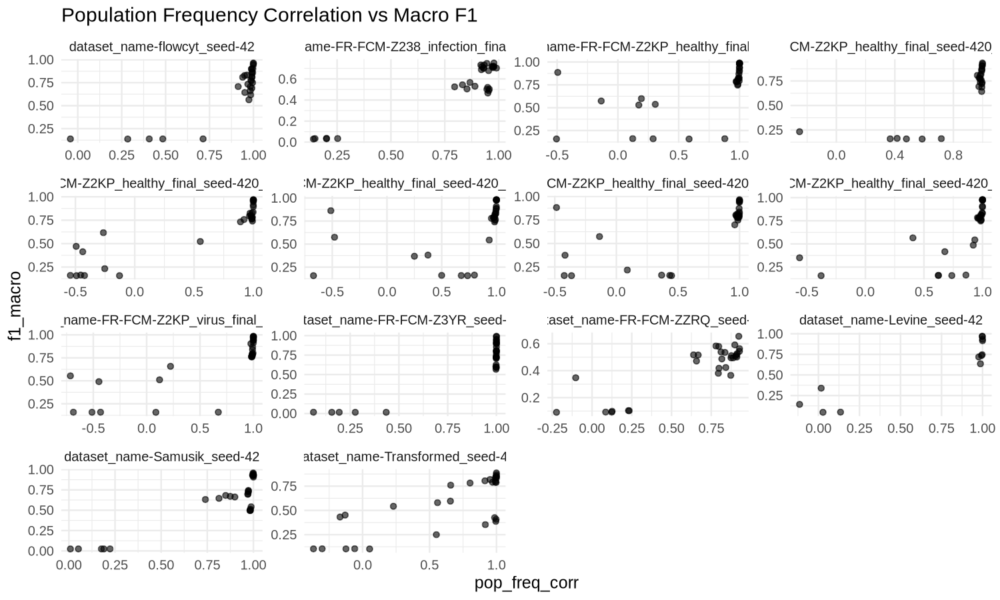

```{r setup, include=FALSE}
knitr::opts_chunk$set(echo = FALSE)
library(readr)
library(dplyr)
library(knitr)
```

## Overview

```{r}
macro_table <- read_tsv('f1_macro_by_crossvalidation.tsv')
population_table <- read_tsv('f1_weighted_by_crossvalidation.tsv')
run_metrics_table <- read_tsv('run_metrics.tsv')
per_population_summary_table <- read_tsv('per_population_summary.tsv')
per_population_stability_table <- read_tsv('per_population_stability.tsv')
per_population_confusion_table <- read_tsv('per_population_confusion.tsv')
rare_population_table <- read_tsv('rare_population_buckets.tsv')
dataset_context_table <- read_tsv('dataset_context.tsv')
dominant_fnr_table <- read_tsv('dominant_errors_fnr.tsv')
dominant_fpr_table <- read_tsv('dominant_errors_fpr.tsv')
summary_counts <- macro_table %>% summarize(
  datasets = n_distinct(dataset),
  models = n_distinct(model),
  crossvalidations = n_distinct(crossvalidation)
)
kable(summary_counts)
```

## Macro F1 By Crossvalidation

```{r}
kable(macro_table)
```

## Per-population Metrics By Crossvalidation

```{r}
kable(population_table)
```

## Run-level Metrics

```{r}
kable(run_metrics_table)
```

## Per-population Summary

```{r}
kable(per_population_summary_table)
```

## Per-population Stability

```{r}
kable(per_population_stability_table)
```

## Per-population Confusion Stats

```{r}
kable(per_population_confusion_table)
```

## Rare Population Buckets

```{r}
kable(rare_population_table)
```

## Dataset Context

```{r}
kable(dataset_context_table)
```

## Dominant Errors (FNR)

```{r}
kable(dominant_fnr_table)
```

## Dominant Errors (FPR)

```{r}
kable(dominant_fpr_table)
```

## Plots

```{r}

```

```{r}

```

```{r}
if (file.exists('plots/f1_macro_by_dataset_boxplot.png')) 
```

```{r}
if (file.exists('plots/samples_vs_f1_macro.png')) 
```

```{r}
if (file.exists('plots/samples_vs_f1_weighted.png')) 
```

```{r}
if (file.exists('plots/samples_vs_runtime.png')) 
```

```{r}
if (file.exists('plots/pop_freq_corr_vs_f1_macro.png')) 
```

## Outputs

```{r}
outputs <- data.frame(
  file = c(
    'f1_macro_by_crossvalidation.tsv',
    'f1_weighted_by_crossvalidation.tsv',
    'f1_macro_summary_by_model.tsv',
    'f1_weighted_summary_by_model.tsv',
    'run_metrics.tsv',
    'per_population_summary.tsv',
    'per_population_stability.tsv',
    'per_population_confusion.tsv',
    'rare_population_buckets.tsv',
    'dataset_context.tsv',
    'dominant_errors_fnr.tsv',
    'dominant_errors_fpr.tsv',
    'samples_vs_f1_macro.tsv',
    'samples_vs_f1_weighted.tsv'
  )
)
kable(outputs)
```

